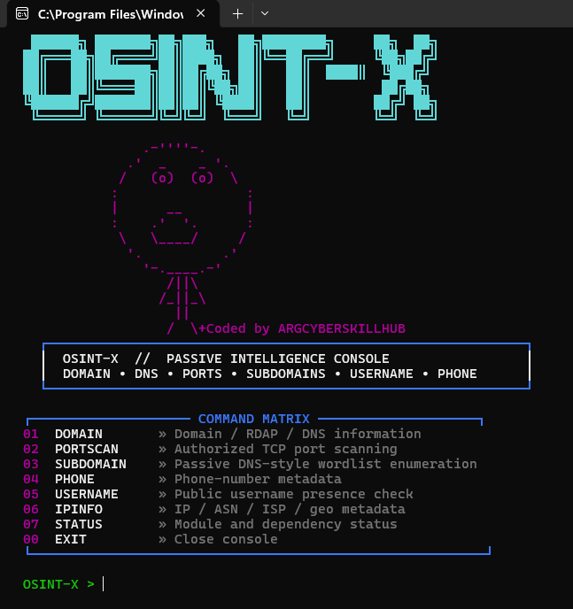

# 🔎 OSINT-X

### Passive Intelligence Console
 OSINT-X // PASSIVE INTELLIGENCE CONSOLE

<p align="center">
  
</p>

DOMAIN • DNS • PORTS • SUBDOMAINS • USERNAME • PHONE
Coded by ARGCYBERSKILLHUB


🧠 About
OSINT-X is a terminal-based Open Source Intelligence and reconnaissance console designed to bring multiple information-gathering modules into one simple command-line interface.
Instead of running multiple tools separately, OSINT-X provides a centralized command matrix for common reconnaissance and OSINT tasks.

The project is intended for:
- Cybersecurity learning
- OSINT research
- Reconnaissance
- Authorized security testing
- CTF environments
- Personal/lab infrastructure
- Security research

| Module | Description |
|---|---|
| `DOMAIN` | Domain / RDAP / DNS information |
| `PORTSCAN` | Authorized TCP port scanning |
| `SUBDOMAIN` | Passive DNS-style wordlist enumeration |
| `PHONE` | Phone-number metadata |
| `USERNAME` | Public username presence checking |
| `IPINFO` | IP / ASN / ISP / geographic metadata |
| `STATUS` | Module and dependency status |

🚀 Installation
1. Clone the Repository

``` command
git clone https://github.com/argcyberskillhub/OSINT-X.git

```
Enter the directory:
``` command
cd OSINT-X
```
3. Install Dependencies
If the project contains requirements.txt:
``` command
pip install -r requirements.txt
```
▶️ Usage
Start OSINT-X:
``` command
python3 OSINT-X.py
```

👨‍💻 Author
ARGCYBERSKILLHUB
ARG Cyber Skill Hub
Learn Today • Secure Tomorrow.

⭐ Support
If you find the project useful:

⭐ Star the repository
🐛 Report bugs
💡 Suggest features
🔧 Contribute improvements
📢 Share the project

⚠️ Disclaimer
OSINT-X is provided for educational, research, and authorized security-testing purposes only.


